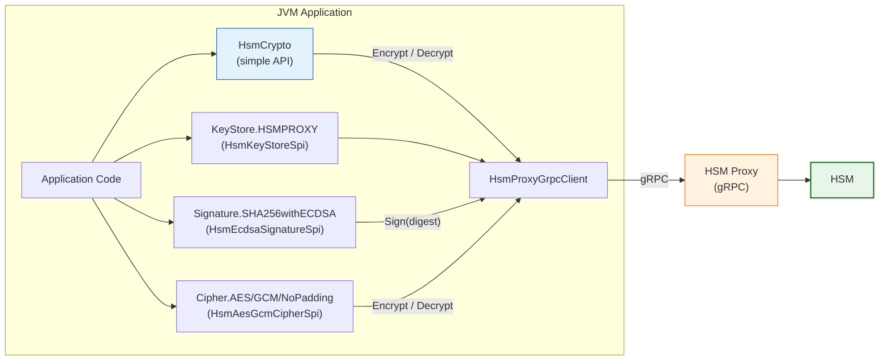

 <br/>

# java-hsm-proxy-provider

Standalone `java.security.Provider` that delegates cryptographic operations to a remote **HSM Proxy** via gRPC.

No key material ever leaves the HSM. The provider stores only a `key_id` string and forwards all operations over gRPC.

## Supported Operations

| API | Use Case | HSM Proxy RPC |
|---|---|---|
| `HsmCrypto.encrypt` / `.decrypt` | Envelope encryption (simple API, recommended) | `Encrypt` / `Decrypt` |
| `Signature` (`SHA256withECDSA`) | TLS handshakes, JWT signing (ES256) | `Sign` |
| `Cipher` (`AES/GCM/NoPadding`) | Envelope encryption (full JCA control) | `Encrypt` / `Decrypt` |
| `KeyStore` (`HSMPROXY`) | Load EC + AES key references from config | `GetCertificate` |

## Architecture



Key material never leaves the HSM. Only digests (for signing) and ciphertext/plaintext (for encrypt/decrypt) travel over
gRPC. `HsmCrypto` (blue) is the recommended entry point for envelope encryption; the JCA SPIs are for TLS integration.

---

## Requirements

- Java 21+
- Maven 3.9+
- A running HSM Proxy exposing the gRPC API defined in [`hsm-proxy.proto`](src/main/proto/hsm-proxy.proto)

---

## Quick Start — Encrypt / Decrypt

For envelope encryption (e.g. wrapping a DEK in the database), `HsmCrypto` is the
simplest path. Set two environment variables:

```
HSM_PROXY_ENDPOINT=hsm-proxy:50051
HSM_PROXY_KEK_ID=vau-db-kek-v1
```

Then call:

```kotlin
val encrypted = HsmCrypto.encrypt(plaintext)
val decrypted = HsmCrypto.decrypt(encrypted)
```

With AAD (prevents ciphertext swapping between DB rows):

```kotlin
val encrypted = HsmCrypto.encrypt(plaintext, aad = "row-42".toByteArray())
val decrypted = HsmCrypto.decrypt(encrypted, aad = "row-42".toByteArray())
```

Override the key per call (e.g. key rotation, multi-tenant):

```kotlin
val encrypted = HsmCrypto.encrypt(plaintext, keyId = "other-kek")
```

No `KeyStore`, no `Cipher.getInstance()`, no `GCMParameterSpec`. Store the returned
blob as-is — it contains the IV, ciphertext, and GCM tag in a single `ByteArray`.

---

## Advanced Usage — JCA Provider API

For TLS integration or when full JCA control is needed (custom `KeyStore`, `Signature`,
`Cipher` instances), use the provider API directly.

**1. Create a config file** (`hsm-keystore.properties`):

```properties
hsm.endpoint=hsm-proxy:50051
# EC key for TLS / signing (certificate fetched via gRPC if cert path omitted)
keys.tls.key_id=zeta-guard-keycloak-tls-es256-v1.p256
# keys.tls.cert=/etc/zeta/certs/tls.pem   # optional disk cert
# AES key for envelope encryption (no certificate needed)
keys.vau-kek.key_id=vau-db-kek-v1
keys.vau-kek.type=aes
```

**2. Register and load at application startup:**

```kotlin
Security.addProvider(HsmProxyProvider())

val ks = KeyStore.getInstance("HSMPROXY")
ks.load(File("hsm-keystore.properties").inputStream(), null)
```

**3a. TLS / Signing** — use the EC key with standard JVM TLS configuration:

```kotlin
val privateKey = ks.getKey("tls", null) as PrivateKey  // HsmEcPrivateKey (phantom)
// Signing is routed to the HSM Proxy transparently via HsmEcdsaSignatureSpi.
```

**3b. Encrypt / Decrypt** — use the AES key for envelope encryption:

```kotlin
val kek = ks.getKey("vau-kek", null) as SecretKey  // HsmSecretKey (phantom)

// Encrypt
val cipher = Cipher.getInstance("AES/GCM/NoPadding")
cipher.init(Cipher.ENCRYPT_MODE, kek)
cipher.updateAAD("row-42".toByteArray())  // optional AAD to prevent ciphertext swapping
val ciphertext = cipher.doFinal(plaintext)
val iv = cipher.iv  // server-generated, must be stored alongside ciphertext

// Decrypt
cipher.init(Cipher.DECRYPT_MODE, kek, GCMParameterSpec(128, iv))
cipher.updateAAD("row-42".toByteArray())  // must match encrypt AAD exactly
val decrypted = cipher.doFinal(ciphertext)
```

**Alternative — static registration** via a custom security properties file (`-Djava.security.properties=...`):

```properties
security.provider.N=de.gematik.zetaguard.hsmproxy.HsmProxyProvider
```

The JAR includes a `META-INF/services/java.security.Provider` entry for ServiceLoader-based discovery.

---

## Examples

Runnable examples are in [`example/`](./example/). Start `hsm_sim` first:

```sh
mvn install -DskipTests
cd example && docker compose up -d
```

**HsmCrypto (simple API)** — encrypt/decrypt in 3 lines:

```sh
mvn compile exec:java -Dexec.mainClass="de.gematik.zetaguard.hsmproxy.example.HsmCryptoExampleKt"
```

**JCA Provider (advanced)** — KeyStore, Signature, Cipher end-to-end:

```sh
mvn compile exec:java
```

---

## Known Limitations

- **EC P-256 only** — only `SHA256withECDSA` is registered. P-384 and P-521 are not yet supported.
- **Signature verification not supported** — `engineInitVerify` is not implemented. Use the standard Sun or BouncyCastle
  provider for verification (the public key is available locally from the certificate).
- **Symmetric encryption is AES-256-GCM with server-generated IV** — per the HSM Proxy proto contract (
  `SymmetricEncryptionAlgorithm.AES_256_GCM`; `EncryptRequest` has no IV field).
- **Plaintext gRPC** — the channel to the HSM Proxy is unencrypted. mTLS support is planned (requirement A_28830).
- **No startup health-check** — the gRPC channel connects lazily on the first operation. A misconfigured or unreachable
  HSM Proxy is not detected at `KeyStore.load()` time.

---

## Build

```sh
mvn package                                                       # compile, generate gRPC stubs, run unit tests
mvn verify -Pit                                                   # also run integration tests (starts hsm_sim via Docker/Testcontainers)
mvn verify -Pit -Dhsm.sim.endpoint=127.0.0.1:15051                # use an already-running hsm_sim instead
mvn clean install -Dspotless.skip=false -Pit
```

---

## License

(C) tech@Spree GmbH, 2026, licensed for gematik GmbH

Apache License, Version 2.0

See the [LICENSE](./LICENSE) for the specific language governing permissions and limitations under the License.

---

## Additional Notes and Disclaimer from gematik GmbH

1. Copyright notice: Each published work result is accompanied by an explicit statement of the license conditions for
   use. These are regularly typical conditions in connection with open source or free software. Programs
   described/provided/linked here are free software, unless otherwise stated.
2. Permission notice: Permission is hereby granted, free of charge, to any person obtaining a copy of this software and
   associated documentation files (the "Software"), to deal in the Software without restriction, including without
   limitation the rights to use, copy, modify, merge, publish, distribute, sublicense, and/or sell copies of the
   Software, and to permit persons to whom the Software is furnished to do so, subject to the following conditions:
    1. The copyright notice (Item 1) and the permission notice (Item 2) shall be included in all copies or substantial
       portions of the Software.
    2. The software is provided "as is" without warranty of any kind, either express or implied, including, but not
       limited to, the warranties of fitness for a particular purpose, merchantability, and/or non-infringement. The
       authors or copyright holders shall not be liable in any manner whatsoever for any damages or other claims arising
       from, out of or in connection with the software or the use or other dealings with the software, whether in an
       action of contract, tort, or otherwise.
    3. We take open source license compliance very seriously. We are always striving to achieve compliance at all times
       and to improve our processes. If you find any issues or have any suggestions or comments, or if you see any other
       ways in which we can improve, please reach out to: ospo@gematik.de
3. Please note: Parts of this code may have been generated using AI-supported technology. Please take this into account,
   especially when troubleshooting, for security analyses and possible adjustments.
